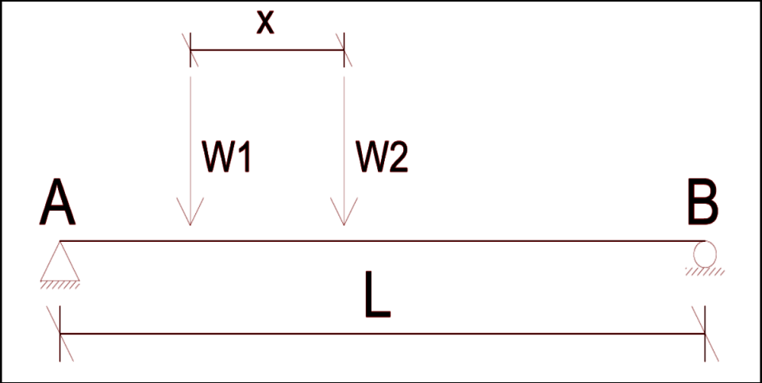

# **Osdag project: FOSSEE**
Develop a **Graphical User Interface** to Calculate **Shear Force** and **Bending Momen**t for a beam experiencing **Two Moving Loads** as shown in figure using **Influence Line Diagram**.


 ---
##  Table of Contents

- [Problem Statement](#problem-statement)
- [Execution Guide](#execution-guide)
- [Demo](#demo-application-in-action)
- [Report](#report)
- [Contact](#contact)

## **Problem Statement**

 Develop an algorithm to calculate the shear force and bending moment values of a simply supported beam subjected to a moving load.

## **Execution Guide**
Follow this process to Execute the Project.

### **Clone the Repository**
1. ```bash
   git clone https://github.com/farazkhan-cyber/Osdag.git

### **Navigate to the App Directory**
1. Make sure you are inside the `Osdag` folder.
    ```bash
   cd Osdag
2. Create a Virtual Environment if Required.

### **Install Dependencies**
1. Use the `requirements.txt` file to install all the necessary libraries:
   ```bash
   pip install -r requirements.txt

### **Run the Application**
1. Execute to start:
   ```bash
   python Main.py

---
## **Demo: Application in Action**


---
## Report
You can view the **detailed report** of this project here:  
  **[Project Report](http://github.com/farazkhan-cyber/Osdag/blob/main/report/report.pdf)**

---
## **Contact**
- **Developer**: Mohd Faraz Khan
- **Email**: [fosterfaraz123@gmail.com](mailto:fosterfaraz123@gmail.com)
- **GitHub Profile**: [farazkhan-cyber](https://github.com/farazkhan-cyber)
